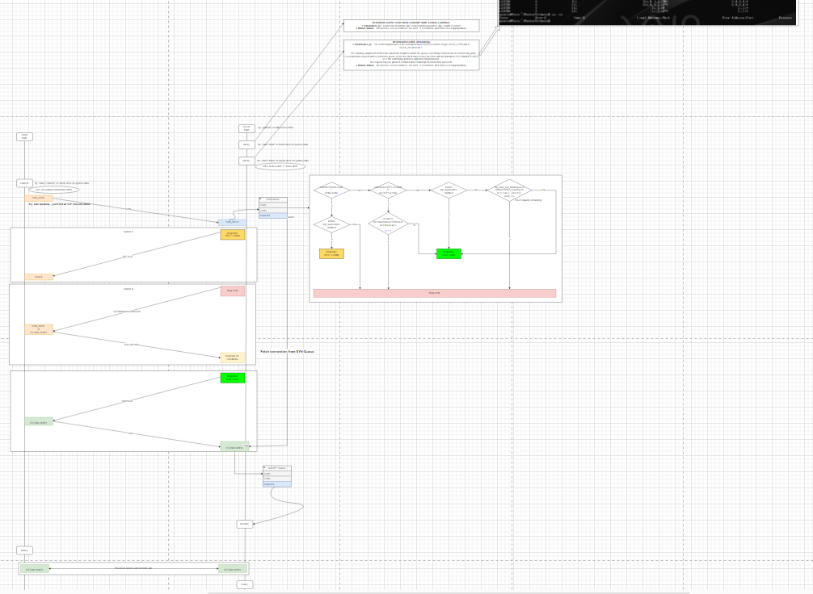

# networks
Debug Test and Restart Over Again.
Every Liitle Thing You Do Is Your Own Leverage In Future. 

# Three-Way Handshakes.
The Detail of Three-Way Handshakes on Connection-Estiblishing in Transport-Control-Protocol

## Thanks so much for references
* [就是要你懂TCP--半连接队列和全连接队列](https://plantegg.github.io/2017/06/07/%E5%B0%B1%E6%98%AF%E8%A6%81%E4%BD%A0%E6%87%82TCP--%E5%8D%8A%E8%BF%9E%E6%8E%A5%E9%98%9F%E5%88%97%E5%92%8C%E5%85%A8%E8%BF%9E%E6%8E%A5%E9%98%9F%E5%88%97/)

