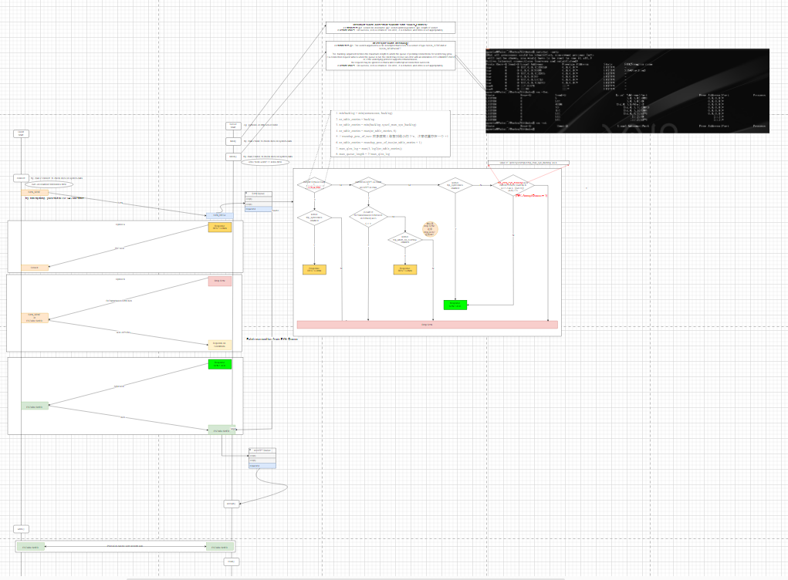
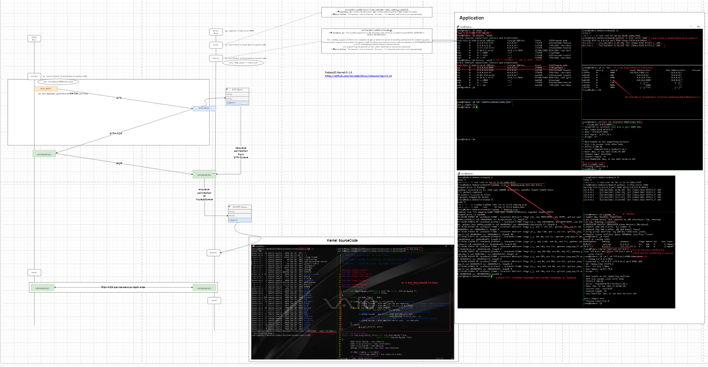
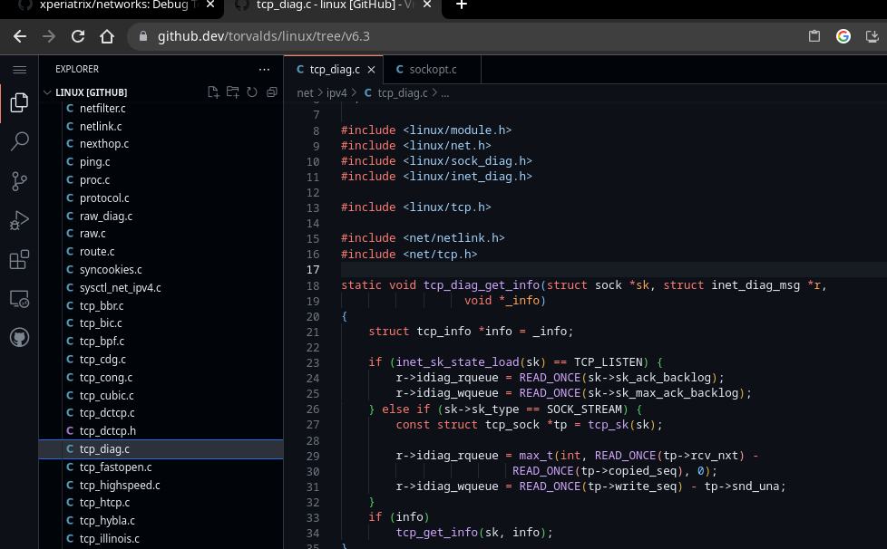
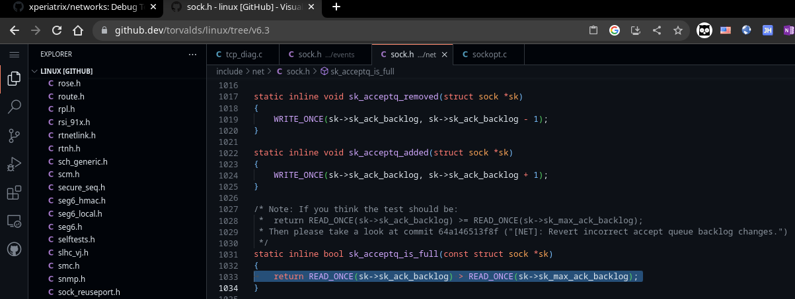
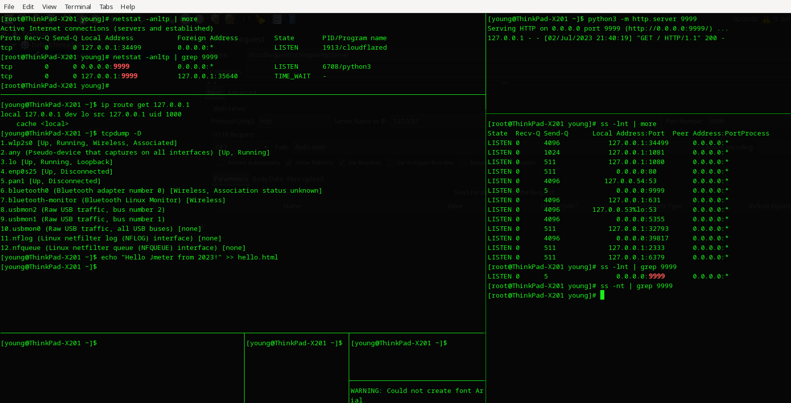
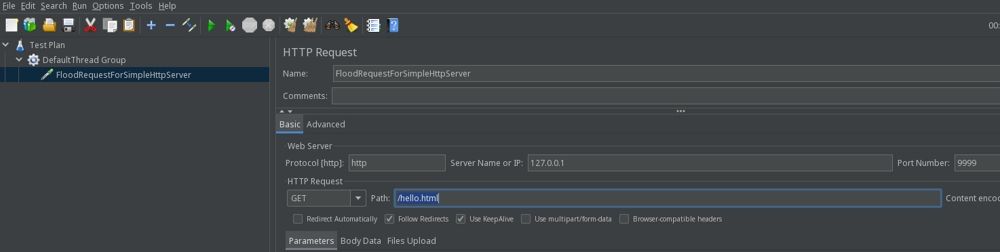
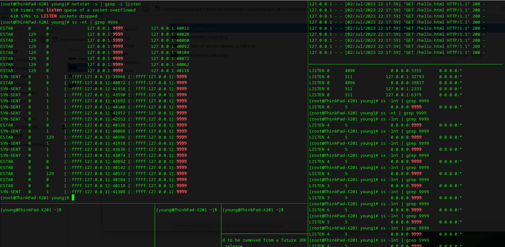
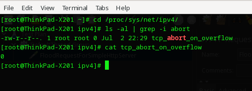

# Networks
Debug Test and Restart Over Again.
Every Liitle Thing You Do Is Your Own Leverage In Future. 

## Three-Way Handshakes in TCP communication. 
The Detail of Three-Way Handshakes on Connection-Estiblishing in Transport-Control-Protocol



 to be continue.
 to be continue.


## Easy FTP-Server Decision for R&D. 
Be very careful that the default value of the max-connections of SimpleHttpServer is 5 on Linux. That's why you'd better setup an Apache-Server instead of SimpleHttpServer as an FTP-Server in LAN, because the default max_conns of Apache-Server is 100 on Linux.

```
ss -lnt | grep -i your_simple_http_server_port  // default max_conn(Send-Q) is 5 on Linux
ss -lnt | grep -i your_apache_http_server_port  // default max_conn(Send-Q) is 100 on Linux
```


PS:
```
//  SYN-Queue Size:  最大半链接数 
backlog = min(1024, 1024) = 1024
nr_table_entries = 1024
nr_table_entries = min(1024, 128) = 128
nr_table_entries = max(128, 8) = 128
nr_table_entries = roundup_pow_of_two(8+1) = <128+1> = 256   最小的2的N次方是 256
max_qlen_log = max(3, log2(256)) = max(3, 8) = 8
max_queue_length = 2^8 = 256
SYN-Queue MaxSize = 256

/**
起初错误的理解：
（半链接队列总长度256 - 当前半链接队列长度x） < 64.  X就是临界值， 
256 - X < 64,  X=192
正确的理解：
 /proc/sys/net/ipv4/tcp_max_syn_backlog 值为 128
(128-X) < 128/4
128-X < 32    X就是临界值, X=96.
*/

```


## Validation Get Started.
I'm testing on the SimpleHttpServer of Python3 on Fedora37 Xfce4-Desktop(Kernel-6.3.8), so I'll compare with [the source codes of Linux-Kernel v6.3 on github](https://github.dev/torvalds/linux/tree/v6.3).

### 1. Standard Three-Way-Handshakes.

+ `ss -lnt` && `ss -nt`


+ Condition of AcceptQueue_Is_Full.


+ Launch a SimpleHttpServer from local host port based on 9999, and run concurrent requests via Jmeter.
1. Prepare for the testing environment.

2. Prepare for the Jmeter for concurrent invoking APIs.

3. Monitor the logs.

4. Reset configuration in kernel. 
