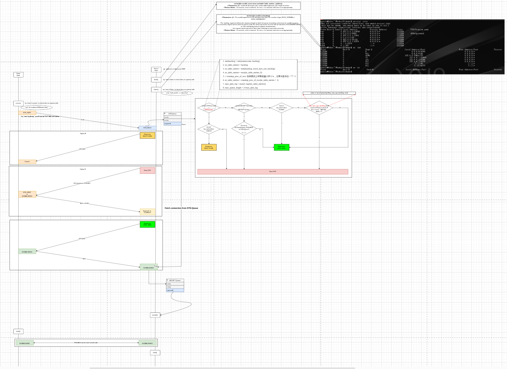

# networks
Debug Test and Restart Over Again.
Every Liitle Thing You Do Is Your Own Leverage In Future. 

## Three-Way Handshakes in TCP communication. 
The Detail of Three-Way Handshakes on Connection-Estiblishing in Transport-Control-Protocol



## Easy FTP-Server Decision for R&D. 
Be very careful that the default value of the max-connections of SimpleHttpServer is 5 on Linux. That's why you'd better setup an Apache-Server instead of SimpleHttpServer as an FTP-Server in LAN, because the default max_conns of Apache-Server is 100 on Linux.

```
ss -lnt | grep -i your_simple_http_server_port  // default max_conn(Send-Q) is 5 on Linux
ss -lnt | grep -i your_apache_http_server_port  // default max_conn(Send-Q) is 100 on Linux
```


## Thanks so much for the refs
* [就是要你懂TCP--半连接队列和全连接队列](https://plantegg.github.io/2017/06/07/%E5%B0%B1%E6%98%AF%E8%A6%81%E4%BD%A0%E6%87%82TCP--%E5%8D%8A%E8%BF%9E%E6%8E%A5%E9%98%9F%E5%88%97%E5%92%8C%E5%85%A8%E8%BF%9E%E6%8E%A5%E9%98%9F%E5%88%97/)

PS:
```
//  SYN-Queue Size:  最大半链接数 
backlog = min(1024, 1024) = 1024
nr_table_entries = 1024
nr_table_entries = min(1024, 128) = 128
nr_table_entries = max(128, 8) = 128
nr_table_entries = roundup_pow_of_two(8+1) = <128+1> = 256   最小的2的N次方是 256
max_qlen_log = max(3, log2(256)) = max(3, 8) = 8
max_queue_length = 2^8 = 256
SYN-Queue MaxSize = 256

/**
起初错误的理解：
（半链接队列总长度256 - 当前半链接队列长度x） < 64.  X就是临界值， 
256 - X < 64,  X=192
正确的理解：
 /proc/sys/net/ipv4/tcp_max_syn_backlog 值为 128
(128-X) < 128/4
128-X < 32    X就是临界值, X=96.
*/

```
